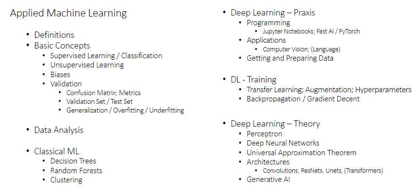
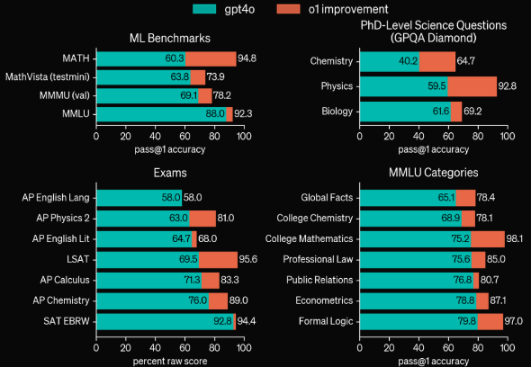
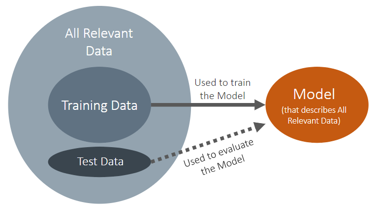

# Logistics - Applied Machine Learning

## Test?

Exam week 2 at uni, reexam after summer
1 A4 single sided note cheat sheet allowed

# Assignments

**nvidia gpu mandatory**

Assignment 1 done individually

Assignment 2-4 done in groups of 3 or 4
Oral questionnarie, need to not slack ot know what the frick is up

Grading:
Pass all assigments

# Introduction

### Overview:

Course objectives:

* Able to **solve** (some) problems with sota solutions
* Get a **general understanding** how it works
* Learn the **terminology**

## AI vs ML vs DL

Artificial Intelligence (AI)

* Many definitions
  * **Automated decision making**
    * catch all term, encapsulates everything
  * Imitating human behaviour

Machine Learning (ML)

* Learning with experience
  * human - get input > improve

Deep Learning (DL)

* Learning with the help of Deep Neural Networks (imitating brains)
  * Imitating nature

Generative AI

* AI or ML model that can generate content (pics, audio, text...)

Large Language Model (LLM)

* Models with gajilions of paramters, trained on vast amounts of data

Generative Pretrained Transformer (GPT)

* Tranformer:
  * A Deep Learning architecture
* Pretrained:
  * model thats already trained on data

## Future of AI

**AGI**
Matcher or suppases in general tasks (not real yet)

**ASI**
Beyond human intellectual abilities (not real yet)
Can super train more models

**Technological Singularity**
Self improving ASI accelerates tech growth with unforseeable consequences

## Actual capabilites of LLMs (2024-10)

## What is Machine Learning?

* Concerned with the question of how to construct programs that automaticall improve with experience
* Program is said to learn from experience E with respect to some class of task T and prefoormance measure P if its performance at task in T as measured by P improves with experience E

Statistics:

* Model first
* Inference

Machine learning

* Data first
* Prediction emphasis
* Separation of training-, validation- and test data

## How do i Train an AI Model?

## Toy example 1: What type of Iris is it?

* 1: get around 50 irises per type
* 2: measure them
* 3: ask experts for correct type
* 4: put info in sheet
* 5: use data as input for ML algorithm
* 6: test model on new data
* 7: use model on newly collected irises to get type!

## Classical Machine Learning (Supervised)

* 1: Data collection

  * get ~50 irises per type
* 2: Feature Engineering

  * measure them
* 3: Supervised Learning

  * ask experts for the correct type
* 4: Digitalization

  * put the info in a sheet
* 5: Training

  * use data as input to a ML algo
* 6: Validation / Testing

  * test the model on some data
* 7: Inference

  * use the model on newly colllected irises to get type

## Emergence

* Emergence
  * ... properties or behaviour whihc emerge only when the parts interact with a wider whole
  * Energy/Atoms - molecules - nucleic.....

# Foundations of Machine Learning

# Deep Learning Praxis

# Deep Learning Theory

# Generative AI

# Classical Machine Learning / Data Analysis
